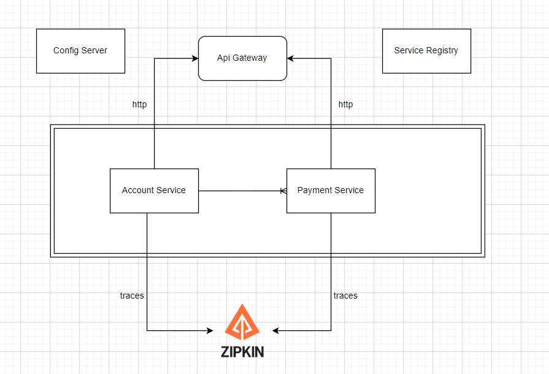

# Payment-system
Payment System with SpringBoot to transfer money between cards

## Описание 

Этот проект представляет собой платежное приложение, которое позволяет пользователям создавать учетные записи и переводить деньги между счетами. 
Приложение создано с использованием `Java` и `Spring Boot`. Он использует базу данных `PostgreSQL` для хранения и связанной с ними информации. Проект состоит из API Gateway, Config Server, Discovery Server и двух микросервисов: `Account` и `PaymentCard`.

## Компоненты проекта

#### API Gateway
Он служит единой точкой входа для всех клиентских запросов, управляя ими и направляя их в соответствующие микросервисы.

#### Configuration server
Централизует управление конфигурацией для всех микросервисов, упрощая обслуживание приложений и обеспечивая согласованность в разных средах.

#### Discovery Server
Он обеспечивает регистрацию и обнаружение служб, обеспечивая бесперебойную связь между службами в экосистеме микрослужб.

#### Account Service
Микросервис учетных записей отвечает за управление данными и операциями, такими как добавление, удаление и получение записей, а также перевод между записями, снятие денег и депозит.

#### Paymend Service
Microservice управляет данными и операциями, связанными с картой, включая добавление, удаление и извлечение карт.

## Запуск
Чтобы запустить проект, выполните следующие действия:
* Клонируйте репозиторий: `git clone https://github.com/Bakbergenchick/payment-system.git`
* Перейдите в проект service-registry и дальше добавляете по порядку проекты:

* Добавить таблицы `account` и `payment` в базу данных  postgres
* Экспортируйте файл json box в Postman, если это необходимо: 
